# java-travel-information-system 基于 Java 的旅游信息管理系统的设计与实现
一个低级程序猿的sql作业罢了，随便看😁，哈哈哈。

____项目地址:____

https://github.com/FirmamentWu/java-


https://gitee.com/firmamentwu/java_travel_information_system


# 项目Presentation
【旅游信息管理-实现效果】 https://www.bilibili.com/video/BV17qafevEAe/?share_source=copy_web&vd_source=69f94f3200d33df280aebf5b0ee9e30b

【旅游信息管理系统-项目部署框架与使用主要技术】 https://www.bilibili.com/video/BV1VAafefEHC/?share_source=copy_web&vd_source=69f94f3200d33df280aebf5b0ee9e30b

【旅游信息管理系统-代码解释】 https://www.bilibili.com/video/BV13MafesE7y/?share_source=copy_web&vd_source=69f94f3200d33df280aebf5b0ee9e30b


# 谢

感谢农大提供给我的学习机会以及指导老师
____程老师____
在旅游信息系统设计过程中的帮助和建议，
____使我系统开发水平得到了提高。____
这是一次很重要的经历，
____有助于我之后的工作生活，____
非常感谢
____程老师的教导与帮助。____

在本次设计中，我使用了 **JAVAWEB、VUE2、Mybatis、Mysql** 等技术。这些技术的结合使系统具备了高性能和良好的用户体验。

- **JAVAWEB**：用于开发系统的后端逻辑和接口，确保了系统的稳定性和安全性。
- **VUE2**：用于构建前端用户界面，提供了响应式和动态的用户体验。
- **Mybatis**：用于数据库访问，简化了数据持久化层的开发，提高了开发效率。
- **Mysql**：作为系统的数据库管理系统，确保了数据的可靠性和一致性。

同时在撰写开发文档的过程中，我创新性地使用了多种技术：

- **Mermaid**：一种用于绘制图表和流程图的技术。我使用 Mermaid 绘制了 **流程图、ER图、模块功能介绍** 等图表，使文档更加直观和易于理解。这不仅提高了文档的可读性，还方便了团队成员之间的沟通和协作。
  
- **Python** 的 **pydot** 库：用于绘制实体的属性表。pydot 库能够将复杂的实体关系图清晰地呈现出来，帮助我们更好地理解和设计数据库结构。

- **tree 命令**：用于生成文件树。tree 命令可以将项目的目录结构以树状图的形式展示出来，使得项目结构一目了然，方便开发和维护。

这些技术的应用不仅使文档和代码紧密结合，还大大提高了文档的可维护性和专业性。在整个设计过程中，我不断调试和优化各项技术，最终成功构建了一个高效、稳定的旅游信息管理系统。

在未来的研究和工作中，我计划进一步探索和应用这些技术，并结合其他先进工具，如使用 
___TikZ___
 绘制复杂的图表和流程图，以全面提升科研文档的质量和表现力。我相信这些经验将对我的未来学习和职业生涯产生积极影响。


## 目录
1. [实验目的](#一实验目的)
2. [实验内容和要求](#二实验内容和要求)
3. [实验重点和难点](#三实验重点和难点)
4. [项目概述](#四项目概述)
5. [课题背景](#五课题背景)
6. [国内外研究现状](#六国内外研究现状)
7. [本文主要内容](#七本文主要内容)
8. [相关技术简介](#八相关技术简介)
    - [JAVA WEB 开发技术](#81-java-web-开发技术)
    - [软件体系结构](#82-软件体系结构)
    - [SQL SERVER 数据库](#83-sql-server-数据库)
9. [需求分析](#九需求分析)
    - [系统可行性研究](#91-系统可行性研究)
    - [系统需求分析](#92-系统需求分析)
    - [系统开发环境](#93-系统开发环境)
10. [系统设计](#十系统设计)
    - [系统架构](#101-系统架构)
    - [系统概要设计](#102-系统概要设计)
    - [各功能模块的结构](#103-各功能模块的结构)
    - [实体属性图及E-R图](#104-实体属性图及E-R图)
    - [表结构设计](#105-表结构设计)
11. [系统实现](#十一系统实现)
    - [前台系统](#111-前台系统)
    - [后台系统（管理员部分）](#112-后台系统管理员部分)
    - [后台系统（普通用户部分）](#113-后台系统普通用户部分)
12. [测试](#十二测试)
13. [代码解释](#十三代码解释)
    - [地方美食管理](#131-地方美食管理)
    - [旅游线路管理](#132-旅游线路管理)
14. [项目结构](#十四项目结构)
16. [参考文献](#十六参考文献)


## 一·实验目的
综合训练学生运用数据库原理、方法和技术进行数据库应用系统分析、设计和开发的能力。

## 二·实验内容和要求
为某个部门或单位开发一个数据库应用系统，具体内容包括：对某个部门或单位业务和数据进行调查，系统分析，系统设计，数据库设计，数据库创建和数据加载，数据库应用软件开发，系统测试，系统分析设计和开发文档撰写，软件、文档和数据库提交，数据库应用系统运行演示和大作业汇报。能够针对某个部门或单位的应用需求，通过系统分析，从数据库数据和应用系统功能两方面进行综合设计，实现一个完整的数据库应用系统。撰写系统设计和开发文档；提交系统文档、数据库应用软件和数据库。

## 三·实验重点和难点
实验重点：数据库设计，数据库应用软件开发。
实验难点：综合运用系统分析与设计方法，从数据和功能两方面协调设计一个完整的数据库应用系统。熟练掌握和运用一个主流数据库应用开发工具进行数据库应用软件开发。

## 四·项目概述
旅游信息管理系统是一个用于管理旅游信息资源的平台。随着旅游信息种类和数量的增加，传统的人力管理方式逐渐无法满足需求，因此开发了这个系统。系统提供了分类管理信息的功能，并以旅游信息的具体方面作为模块划分依据，旨在提高信息管理效率，节省人力物力资源。

## 五·课题背景
随着我国人们生活水平的不断提高，旅游逐渐成为人们工作之余放松压力、调节情绪的首要选择。近年来，我国旅游游客规模不断扩大，旅游业得到快速发展，但也带来了更激烈的竞争。面对更复杂的旅游业务需求，现在旅游业必须加大对当地旅游资源的宣传力度，采用更先进的技术来完成日常管理，为游客提供优质服务，帮助他们在出行时快捷、方便地查询旅游目的地的景点、美食、交通情况。这将有助于提高城市的旅游形象和旅游服务水平。

## 六·国内外研究现状
随着计算机和网络技术的快速发展，其在社会各行各业的应用逐渐普及，越来越多的行业采用先进的计算机网络技术来管理行业信息。目前，世界范围内已有多个国家和地区成功实施了旅游信息管理系统。然而，国内旅游业的信息化进程相对缓慢，大多数城市的旅游宣传和管理方式仍以人工为主，这不仅浪费了人力和物力资源，也限制了旅游业的发展。国际上，一些发达国家已广泛使用信息管理系统来管理旅游信息，提供高度自动化和用户友好的服务平台。

## 七·本文主要内容
本文主要介绍基于 Java 技术的旅游信息管理系统的设计与实现过程。系统旨在通过现代信息技术整合和管理旅游信息资源，提高信息管理的效率，为游客提供快捷、方便的查询服务。

## 八·相关技术简介

### 8.1 JAVA WEB 开发技术

#### 8.1.1 MVC 模式
MVC（Model-View-Controller）模式是一种软件设计模式，常用于创建 Web 应用。它将应用程序分为三个部分：模型（Model）、视图（View）和控制器（Controller），从而实现数据与用户界面的分离。

#### 8.1.2 Vue 2 框架
Vue 2 是一个用于构建用户界面的渐进式 JavaScript 框架。它采用基于组件的开发模式，提供了响应式的数据绑定和强大的工具链，适用于构建复杂的单页应用程序。Vue 2 具有轻量级、高性能和易于集成的特点，广泛应用于各种 Web 项目中。

#### 8.1.3 Java Web 开发
Java Web 开发是指使用 Java 技术进行 Web 应用程序的开发。常用的技术栈包括 Mybatis、VUE、Spring MVC 等，适用于构建高性能、可扩展的企业级 Web 应用。

#### 8.1.4 MyBatis 框架
MyBatis 是一个优秀的持久层框架，它支持自定义 SQL、存储过程以及高级映射。MyBatis 避免了几乎所有的 JDBC 代码和手动设置参数以及获取结果集。MyBatis 可以与各种数据库和编程语言集成，适用于构建复杂的企业级应用程序。

### 8.2 软件体系结构

#### 8.2.1 B/S 结构
B/S（Browser/Server，浏览器/服务器）结构是网络应用中一种常见的架构模式。客户端通过浏览器访问服务器，服务器处理请求并返回数据。该结构便于维护和更新应用程序，且不需要安装客户端软件。

#### 8.2.2 C/S 结构
C/S（Client/Server，客户端/服务器）结构是另一种常见的架构模式，客户端软件需要安装在用户的本地计算机上，通过网络与服务器通信。该结构多用于桌面应用和需要较高交互性的应用。

___在这里我们主要使用B/S结构___

### 8.3 MySQL 数据库
MySQL 是一个开源的关系数据库管理系统，它支持多用户环境下的数据库应用。MySQL 提供了存储、查询、更新数据的功能，并能与多种编程语言和平台紧密集成，为企业级应用提供强大的数据支持。

## 九·需求分析

### 9.1 系统可行性研究
在开发旅游信息管理系统之前，必须进行系统可行性研究。研究应包括技术可行性、经济可行性和操作可行性。通过这些研究，能够确定系统是否值得开发，是否符合预期目标，以及是否能够顺利实施。

#### 9.1.1 技术可行性
随着计算机技术、网络技术和数据库技术的快速发展，人们的生活逐渐信息化。旅游信息管理系统可以采用先进的信息化技术来进行数据处理、信息存储和用户界面的开发。基于 B/S（浏览器/服务器）结构，用户可以通过浏览器访问系统，服务器端处理数据请求并返回结果。这种模式便于系统的维护和扩展，提高了系统的稳定性和安全性。

#### 9.1.2 经济可行性
开发和运行旅游信息管理系统需要一定的资金投入，包括硬件和软件的采购、开发团队的薪酬以及系统的维护和更新。虽然初期投入较大，但通过信息化系统的应用，可以显著提高旅游信息管理的效率，减少人力和物力的浪费，从长远来看具有很高的经济效益。

#### 9.1.3 操作可行性
系统的操作应简便易用，使得用户和管理员能够方便地进行各种操作。通过友好的用户界面和清晰的操作指引，系统能够确保用户快速上手并完成所需操作。系统还应具备良好的兼容性和稳定性，保证在不同操作环境下的正常运行。

### 9.2 系统需求分析

#### 9.2.1 系统实现目标
系统的主要目标是为游客提供一个全面、便捷的旅游信息查询平台，帮助他们在计划出行时能快速获取所需信息。同时，系统还需要为旅游管理者提供有效的工具，以便他们能够更好地管理和宣传当地的旅游资源。

#### 9.2.2 系统功能需求
系统需要具备的功能包括用户注册与登录、旅游景点信息的查询、旅游路线规划、美食查询、旅游线路查询、在线留言与反馈等。

#### 9.2.3 系统用例分析
系统用例分析是识别系统各部分行为的重要步骤。通过用例图，可以明确系统中不同用户的交互模式及其需要完成的任务。例如，用户注册与登录、景点信息查询、路线规划、等都是系统的重要用例，每个用例都涉及到用户和系统之间的交互过程。

#### 9.2.4 系统性能需求
系统应具备以下性能要求：
1. **响应速度**：系统应具有较高的响应速度，确保用户能够在较短的时间内获取所需信息。
2. **可靠性**：系统应具备较高的可靠性，确保数据的完整性和用户信息的安全。
3. **扩展性**：系统应具备良好的扩展性，以便未来增加新功能或进行系统升级。
4. **安全性**：系统应具备良好的安全性，保护用户数据和系统数据免受未经授权的访问和操作。

### 9.3 系统开发环境
系统的开发环境包括硬件环境和软件环境。

#### 9.3.1 硬件环境
- 服务器：用于部署系统的服务器，需要具备较高的性能和稳定性。
- 客户端设备：用户通过浏览器访问系统，可以使用个人电脑、平板电脑或智能手机等设备。

#### 9.3.2 软件环境
- 操作系统：服务器操作系统可以选择 Linux 或 Windows，客户端操作系统不限。
- 开发工具：使用 Eclipse 或 IntelliJ IDEA 进行系统开发。
- 编程语言：系统开发采用 Java 语言。
- 数据库：使用 MySQL 作为数据库管理系统。

以上内容为旅游信息管理系统的详细需求分析，涵盖了系统可行性研究、系统需求分析及系统开发环境的各个方面。通过这些分析，可以为系统的设计与开发提供明确的指导和参考。


## 十·系统设计

### 10.1 系统架构

#### 10.1.1 软件架构

本文的旅游信息管理系统采用当前 Web 应用流行的 B/S 架构，采用 Java 技术开发，系统设计具有一定的灵活性，在系统开发时也具有较高的效率。在系统层，系统用户能够采用各类浏览器实现对旅游信息管理系统前台和后台界面的访问，实现具体的数据交互功能和业务处理功能。在用层，使用 Java 技术和 VUE平台能够实现旅游信息管理系统前后台功能的开发。在数据层，应用 MySQL 对系统的业务和处理数据进行存储、管理和维护，并对旅游信息管理系统中的功能需求进行支持。


```mermaid
graph LR
    A[系统用户] -->|各类浏览器| B[旅游信息管理系统]
    B -->|前台界面| C[数据交互功能]
    B -->|后台界面| D[业务处理功能]
    C --> E[JavaWeb 技术]
    D --> E
    E --> F[MySQL]
    E --> G[MyBatis]
    F --> H[数据存储]
    F --> I[数据管理]
    F --> J[数据维护]
    C --> K[Vue 2 平台]
    D --> K
```


#### 10.1.2 网络架构

因为本文的旅游信息管理系统是 B/S 结构，所以在网络架构设计时采用四层和两层的网络结构。系统用户和系统管理员可以使用任何具备 Internet 浏览功能的浏览器，通过 Http 协议访问实现对系统的访问，不需要在客户机上安装任何客户端程序。

```mermaid
graph LR
    A[系统用户] -->|Internet| B[旅游信息管理系统]
    B -->|Http 协议| C[系统访问]
    C -->|浏览器| D[无客户端程序]
    D --> E[系统管理员]
    D --> F[系统用户]
    G[系统管理员] -->|Internet| B
```

### 10.2 系统的概要设计

#### 10.2.1 系统的总体功能结构

在概要设计中，要根据前面所完成的系统需求分析和文档信息，定义系统的主要功能及相应结构。功能分为前台展示和后台维护两个部分，其中前台展示主要包括旅游景点、地方美食、旅游线路等信息的展示及查询，后台维护包括管理员对这些信息的增删改查操作。系统的总体功能结构如图所示。

```mermaid
graph TD
    A[前台展示] --> B[旅游景点展示]
    A --> C[地方美食展示]
    A --> D[旅游线路展示]
    A --> L[旅游新闻]
    A --> E[用户登录]
    B --> F[景点查询]
    C --> G[美食查询]
    D --> H[线路查询与预订]
    L --> M[旅游新闻公式]
    E --> I[个人主页]
    E --> J[线路预订]
    E --> K[个人信息管理]

    style M fill:#ffb,stroke:#333,stroke-width:2px;
    style F fill:#ffb,stroke:#333,stroke-width:2px;
    style G fill:#ffb,stroke:#333,stroke-width:2px;
    style H fill:#ffb,stroke:#333,stroke-width:2px;
    style I fill:#f9f,stroke:#333,stroke-width:2px;
    style J fill:#f9f,stroke:#333,stroke-width:2px;
    style K fill:#f9f,stroke:#333,stroke-width:2px;
```

# 10.3 各功能模块的结构

本节对系统部分功能模块的结构再进一步细化。

## 10.3.1 用户登录模块
- 用户通过用户名和密码登录系统，区分管理员和普通用户，分别进入不同的系统界面。

```mermaid
graph LR
    A[用户登录] -->|用户名和密码| B{身份验证}
    B -->|管理员| C[管理后台]
    B -->|普通用户| D[个人主页]
```

## 10.3.2 主页功能模块
- 普通用户登录后进入个人主页，可以进行旅游线路预订和管理个人信息，界面直观友好。

```mermaid
graph LR
    A[个人主页] --> B[旅游线路预订]
    A --> C[管理个人信息]
```

## 10.3.3 账号模块
- 管理员对系统账号进行增删查改，确保系统账号的安全和有效管理。

```mermaid
graph TD
    A[账号] --> B[增加账号]
    A --> C[删除账号]
    A --> D[修改账号]
    A --> E[查询账号]
    
```

## 10.3.4 用户模块
- 管理员对普通用户的账号进行增删查改及修改密码，确保用户信息的准确和安全。

```mermaid
graph TD
    A[用户] --> B[增加用户]
    A --> C[删除用户]
    A --> D[修改用户]
    A --> E[查询用户]
    A --> F[修改密码]
    
```

## 10.3.5 地区模块
- 管理员对系统中的境外、境内、本地三个地区的信息进行增删查改。

```mermaid
graph TD
    A[地区] --> B[增加地区]
    A --> C[删除地区]
    A --> D[修改地区]
    A --> E[查询地区]
    
```

## 10.3.6 景点模块
- 管理员对景点信息进行增删查改，包括编辑景点描述和详情信息，确保旅游景点信息的准确和更新。

```mermaid
graph TD
    A[景点] --> B[增加景点]
    A --> C[删除景点]
    A --> D[修改景点]
    A --> E[查询景点]
    A --> F[编辑描述]
    A --> G[编辑详情]
    
```

## 10.3.7 地方美食模块
- 管理员管理地方美食信息，包括美食编号、名称、附近景点分类、人均价格、美食简介等，支持美食分类添加查询与地方美食添加查询。

```mermaid
graph TD
    A[地方美食] --> B[增加美食]
    A --> C[删除美食]
    A --> D[修改美食]
    A --> E[查询美食]
    A --> F[美食分类添加]
    A --> G[美食分类查询]
    
```

## 10.3.8 旅游线路模块
- 管理员管理旅游线路信息，包括旅游编号、线路名称、图片、出发地、途径地、终点、价格、浏览量等，支持线路详情查看和打印。

```mermaid
graph TD
    A[旅游线路] --> B[增加线路]
    A --> C[删除线路]
    A --> D[修改线路]
    A --> E[查询线路]
    A --> F[查看详情]
    A --> G[打印详情]
    
```

## 10.3.9 订单信息模块
- 管理员查看每个用户的预订信息，确保订单处理的准确和及时。

```mermaid
graph LR
    A[订单信息] --> B[查看预订信息]
    B --> C[处理订单]
```

## 10.3.10 新闻模块
- 管理员管理旅游相关的新闻信息，包括新闻分类的添加查询及新闻内容的添加查询。

```mermaid
graph TD
    A[新闻] --> B[增加新闻分类]
    A --> C[删除新闻分类]
    A --> D[修改新闻分类]
    A --> E[查询新闻分类]
    A --> F[增加新闻内容]
    A --> G[删除新闻内容]
    A --> H[修改新闻内容]
    A --> I[查询新闻内容]
    
```

## 10.3.11 系统模块
- 管理员管理系统内容的丰富性和用户互动的有效性，包括友情链接的添加查询、轮播图的添加查询及留言管理。

```mermaid
graph TD
    A[系统] --> B[添加友情链接]
    A --> C[查询友情链接]
    A --> D[添加轮播图]
    A --> E[查询轮播图]
    A --> F[留言管理]
    
```

## 10.3.12 线路预订模块
- 普通用户进行旅游线路的预订，方便快捷。

```mermaid
graph LR
    A[线路预订] --> B[选择线路]
    B --> C[预订线路]
    C --> D[支付]
    D --> E[确认预订]
    
```

## 10.3.13 个人中心模块
- 普通用户管理个人资料、修改密码、查看收藏、留言互动等功能。

```mermaid
graph TD
    A[个人中心] --> B[修改个人资料]
    A --> C[修改密码]
    A --> D[查看收藏]
    A --> E[留言互动]
```

### 10.4 实体属性图及 E-R 图

#### 10.4.1 实体属性图

系统设计中，每个实体的属性关系都需要明确。以下是系统中的一些主要实体及其属性图：


*图4.1 admins 实体属性图*


*图4.2 difangmeishi 实体属性图*


*图4.3 diqu 实体属性图*


*图4.4 jingdianxinxi 实体属性图*


*图4.5 liuyanban 实体属性图*


*图4.6 lunbotu 实体属性图*


*图4.7 lvyouxianlu 实体属性图*


*图4.8 meishifenlei 实体属性图*


*图4.9 shoucangjilu 实体属性图*


*图4.10 token 实体属性图*


*图4.11 xinwenfenlei 实体属性图*


*图4.12 xinwenxinxi 实体属性图*


*图4.13 yonghu 实体属性图*


*图4.14 youqinglianjie 实体属性图*


*图4.15 yuding 实体属性图*
#### 10.4.2 系统部分 E-R 图

系统部分 E-R 图描述了系统中实体及其关系。该 E-R 图包括用户、管理员、景点、酒店、线路、航班、火车、客车、公交、论坛贴子等实体。


### 10.5 表结构设计

在进行数据库逻辑模型设计后，需要根据所使用的数据库管理系统，设计实际存放数据的数据表结构的物理模型。在本节中，以部分数据表的定义为例，说明对数据库物理结构设计的结果。

#### 10.5.1 admins 表

admins 表用来存储管理员的相关信息。

| 字段名称  | 类型      | 长度 | 是否为空 | 是否为主键 | 说明     |
|-----------|-----------|------|----------|------------|----------|
| id        | int       | 10   | 否       | 是         | 管理员编号 |
| username  | varchar   | 50   | 否       | 否         | 帐号     |
| pwd       | varchar   | 50   | 否       | 否         | 密码     |
| addtime   | timestamp | -    | 否       | 否         | 添加时间 |

#### 10.5.2 difangmeishi 表

difangmeishi 表用来存储地方美食的相关信息。

| 字段名称      | 类型      | 长度 | 是否为空 | 是否为主键 | 说明         |
|---------------|-----------|------|----------|------------|--------------|
| id            | int       | 10   | 否       | 是         | 美食编号     |
| meishibianhao | varchar   | 50   | 否       | 否         | 美食编号     |
| mingcheng     | varchar   | 255  | 否       | 否         | 名称         |
| fujinjingdian | varchar   | 255  | 否       | 否         | 附近景点     |
| fenlei        | int       | 10   | 否       | 否         | 分类         |
| tupian        | text      | -    | 否       | 否         | 图片         |
| jiage         | decimal   | 18,2 | 否       | 否         | 价格         |
| meishijianjie | text      | -    | 否       | 否         | 美食简介     |
| addtime       | timestamp | -    | 否       | 否         | 添加时间     |

#### 10.5.3 diqu 表

diqu 表用来存储地区的相关信息。

| 字段名称      | 类型      | 长度 | 是否为空 | 是否为主键 | 说明         |
|---------------|-----------|------|----------|------------|--------------|
| id            | int       | 10   | 否       | 是         | 地区编号     |
| diqumingcheng | varchar   | 255  | 否       | 否         | 地区名称     |
| addtime       | timestamp | -    | 否       | 否         | 添加时间     |

#### 10.5.4 jingdianxinxi 表

jingdianxinxi 表用来存储景点的信息。

| 字段名称       | 类型       | 长度 | 是否为空 | 是否为主键 | 说明         |
|----------------|------------|------|----------|------------|--------------|
| id             | int        | 10   | 否       | 是         | 景点编号     |
| jingdianbianhao| varchar    | 50   | 否       | 否         | 景点编号     |
| jingdianmingcheng | varchar| 255  | 否       | 否         | 景点名称     |
| suoshudiqu     | int        | 10   | 否       | 否         | 所属地区     |
| tupian         | text       | -    | 否       | 否         | 图片         |
| kaifangshijian | varchar    | 255  | 否       | 否         | 开放时间     |
| fujinmeishi    | text       | -    | 否       | 否         | 附近美食     |
| dizhi          | varchar    | 255  | 否       | 否         | 地址         |
| piaojia        | decimal    | 18,2 | 否       | 否         | 票价         |
| liulanliang    | int        | 11   | 否       | 否         | 浏览量       |
| miaoshu        | longtext   | -    | 否       | 否         | 描述         |
| addtime        | timestamp  | -    | 否       | 否         | 添加时间     |

#### 10.5.5 liuyanban 表

liuyanban 表用来存储留言板的信息。

| 字段名称       | 类型       | 长度 | 是否为空 | 是否为主键 | 说明         |
|----------------|------------|------|----------|------------|--------------|
| id             | int        | 10   | 否       | 是         | 留言编号     |
| xingming       | varchar    | 50   | 否       | 否         | 姓名         |
| lianxidianhua  | varchar    | 50   | 否       | 否         | 联系电话     |
| liuyanneirong  | text       | -    | 否       | 否         | 留言内容     |
| liuyanren      | varchar    | 50   | 否       | 否         | 留言人       |
| huifuneirong   | text       | -    | 否       | 否         | 回复内容     |
| addtime        | timestamp  | -    | 否       | 否         | 添加时间     |

#### 10.5.6 lunbotu 表

lunbotu 表用来存储轮播图的信息。

| 字段名称       | 类型       | 长度 | 是否为空 | 是否为主键 | 说明         |
|----------------|------------|------|----------|------------|--------------|
| id             | int        | 10   | 否       | 是         | 轮播图编号   |
| title          | varchar    | 50   | 否       | 否         | 标题         |
| image          | varchar    | 255  | 否       | 否         | 图片         |
| url            | varchar    | 255  | 否       | 否         | 连接地址     |
| addtime        | timestamp  | -    | 否       | 否         | 添加时间     |

#### 10.5.7 lvyouxianlu 表

lvyouxianlu 表用来存储旅游线路的信息。

| 字段名称       | 类型       | 长度 | 是否为空 | 是否为主键 | 说明         |
|----------------|------------|------|----------|------------|--------------|
| id             | int        | 10   | 否       | 是         | 线路编号     |
| xianlubianhao  | varchar    | 50   | 否       | 否         | 线路编号     |
| xianlumingcheng| varchar    | 255  | 否       | 否         | 线路名称     |
| tupian         | text       | -    | 否       | 否         | 图片         |
| chufadi        | varchar    | 255  | 否       | 否         | 出发地       |
| tujingdi       | varchar    | 255  | 否       | 否         | 途经地       |
| zhongdian      | varchar    | 255  | 否       | 否         | 终点         |
| jiage          | decimal    | 18,2 | 否       | 否         | 价格         |
| liulanliang    | int        | 11   | 否       | 否         | 浏览量       |
| xianlutese     | longtext   | -    | 否       | 否         | 线路特色     |
| xianlujianjie  | longtext   | -    | 否       | 否         | 线路简介     |
| addtime        | timestamp  | -    | 否       | 否         | 添加时间     |

#### 10.5.8 meishifenlei 表

meishifenlei 表用来存储美食分类的信息。

| 字段名称       | 类型       | 长度 | 是否为空 | 是否为主键 | 说明         |
|----------------|------------|------|----------|------------|--------------|
| id             | int        | 10   | 否       | 是         | 分类编号     |
| fenleimingcheng| varchar    | 255  | 否       | 否         | 分类名称     |
| addtime        | timestamp  | -    | 否       | 否         | 添加时间     |

#### 10.5.9 shoucangjilu 表

shoucangjilu 表用来存储收藏记录的信息。

| 字段名称       | 类型       | 长度 | 是否为空 | 是否为主键 | 说明         |
|----------------|------------|------|----------|------------|--------------|
| id             | int        | 10   | 否       | 是         | 记录编号     |
| username       | varchar    | 255  | 否       | 否         | 收藏用户     |
| xwid           | int        | 10   | 否       | 否         | 对应模块id   |
| biao           | varchar    | 255  | 否       | 否         | 收藏的模块   |
| biaoti         | varchar    | 255  | 否       | 否         | 显示的标题   |
| url            | varchar    | 512  | 否       | 否         | 收藏URL      |
| ziduan         | varchar    | 255  | 否       | 否         | 对应模块字段 |
| addtime        | timestamp  | -    | 否       | 否         | 添加时间     |

#### 10.5.10 token 表

token 表用来存储前端登录凭证的信息。

| 字段名称       | 类型       | 长度 | 是否为空 | 是否为主键 | 说明         |
|----------------|------------|------|----------|------------|--------------|
| token          | char       | 32   | 否       | 是         | 唯一值       |
| session        | text       | -    | 否       | 否         | 保存的数据   |
| cx             | varchar    | 50   | 否       | 否         | 登录权限     |
| login          | varchar    | 50   | 否       | 否         | 登录模块     |
| username       | varchar    | 50   | 否       | 否         | 登录用户     |
| valueid        | varchar    | 50   | 否       | 否         | 用户id       |
| token_time     | timestamp  | -    | 否       | 否         | 当前时间     |

#### 10.5.11 xinwenfenlei 表

xinwenfenlei 表用来存储新闻分类的信息。

| 字段名称       | 类型       | 长度 | 是否为空 | 是否为主键 | 说明         |
|----------------|------------|------|----------|------------|--------------|
| id             | int        | 10   | 否       | 是         | 分类编号     |
| fenleimingcheng| varchar    | 50   | 否       | 否         | 分类名称     |
| addtime        | timestamp  | -    | 否       | 否         | 添加时间     |

#### 10.5.12 xinwenxinxi 表

xinwenxinxi 表用来存储新闻信息。

| 字段名称       | 类型       | 长度 | 是否为空 | 是否为主键 | 说明         |
|----------------|------------|------|----------|------------|--------------|
| id             | int        | 10   | 否       | 是         | 新闻编号     |
| biaoti         | varchar    | 255  | 否       | 否         | 标题         |
| fenlei         | int        | 10   | 否       | 否         | 分类         |
| tupian         | varchar    | 255  | 否       | 否         | 图片         |
| tianjiaren     | varchar    | 50   | 否       | 否         | 添加人       |
| dianjilv       | int        | 11   | 否       | 否         | 点击率       |
| neirong        | longtext   | -    | 否       | 否         | 内容         |
| addtime        | timestamp  | -    | 否       | 否         | 添加时间     |

#### 10.5.13 yonghu 表

yonghu 表用来存储用户的信息。

| 字段名称       | 类型       | 长度 | 是否为空 | 是否为主键 | 说明         |
|----------------|------------|------|----------|------------|--------------|
| id             | int        | 10   | 否       | 是         | 用户编号     |
| yonghuming     | varchar    | 50   | 否       | 否         | 用户名       |
| mima           | varchar    | 50   | 否       | 否         | 密码         |
| xingming       | varchar    | 50   | 否       | 否         | 姓名         |
| xingbie        | varchar    | 255  | 否       | 否         | 性别         |
| shouji         | varchar    | 50   | 否       | 否         | 手机         |
| youxiang       | varchar    | 50   | 否       | 否         | 邮箱         |
| shenfenzheng   | varchar    | 50   | 否       | 否         | 身份证       |
| touxiang       | varchar    | 255  | 否       | 否         | 头像         |
| addtime        | timestamp  | -    | 否       | 否         | 添加时间     |

#### 10.5.14 youqinglianjie 表

youqinglianjie 表用来存储友情链接的信息。

| 字段名称       | 类型       | 长度 | 是否为空 | 是否为主键 | 说明         |
|----------------|------------|------|----------|------------|--------------|
| id             | int        | 10   | 否       | 是         | 友情链接编号 |
| wangzhanmingcheng| varchar  | 50   | 否       | 否         | 网站名称     |
| wangzhi        | varchar    | 50   | 否       | 否         | 网址         |
| addtime        | timestamp  | -    | 否       | 否         | 添加时间     |

#### 10.5.15 yuding 表

yuding 表用来存储预定的信息。

| 字段名称       | 类型       | 长度 | 是否为空 | 是否为主键 | 说明         |
|----------------|------------|------|----------|------------|--------------|
| id             | int        | 10   | 否       | 是         | 预定编号     |
| lvyouxianluid  | int        | 10   | 否       | 否         | 旅游线路id   |
| xianlubianhao  | varchar    | 50   | 否       | 否         | 线路编号     |
| xianlumingcheng| varchar    | 255  | 否       | 否         | 线路名称     |
| chufadi        | varchar    | 255  | 否       | 否         | 出发地       |
| tujingdi       | varchar    | 255  | 否       | 否         | 途经地       |
| zhongdian      | varchar    | 255  | 否       | 否         | 终点         |
| jiage          | decimal    | 18,2 | 否       | 否         | 价格         |
| dingdanhao     | varchar    | 50   | 否       | 否         | 订单号       |
| yudingshijian  | varchar    | 25   | 否       | 否         | 预订时间     |
| yudingrenxingming| varchar  | 50   | 否       | 否         | 预订人姓名   |
| lianxifangshi  | varchar    | 50   | 否       | 否         | 联系方式     |
| zhuangtai      | varchar    | 50   | 否       | 否         | 状态         |
| beizhu         | text       | -    | 否       | 否         | 备注         |
| yudingren      | varchar    | 50   | 否       | 否         | 预订人       |
| addtime        | timestamp  | -    | 否       | 否         | 添加时间     |
| iszf           | varchar    | 10   | 否       | 否         | 是否支付     |


明白了，我将按要求将小标题进行编号，确保所有小标题都有明确的编号。下面是修改后的Markdown代码：

### 十一·系统实现

#### 11.1 前台系统

##### 11.1.1 用户登录
首先是用户登录部分，用户可以通过用户名和密码登录系统：


##### 11.1.2 区分登录身份
登录区分管理员与普通用户，管理员和普通用户会进入不同的系统界面：


- **管理员登录**：管理员登录会直接进入管理后台，方便进行管理操作。
    

- **普通用户登录**：普通用户登录后会进入个人主页，主页中包含了线路预订与个人中心功能。
    
    

##### 11.1.3 主页功能
普通用户登录后进入个人主页，可以进行线路预订和管理个人信息。主页界面直观友好，方便用户快速找到所需功能。


#### 11.2 后台系统（管理员部分）

##### 11.2.1 账号管理
管理员在后台可以对系统账号进行管理，实现管理员账户的增删查改。该功能确保系统账号的安全和有效管理。

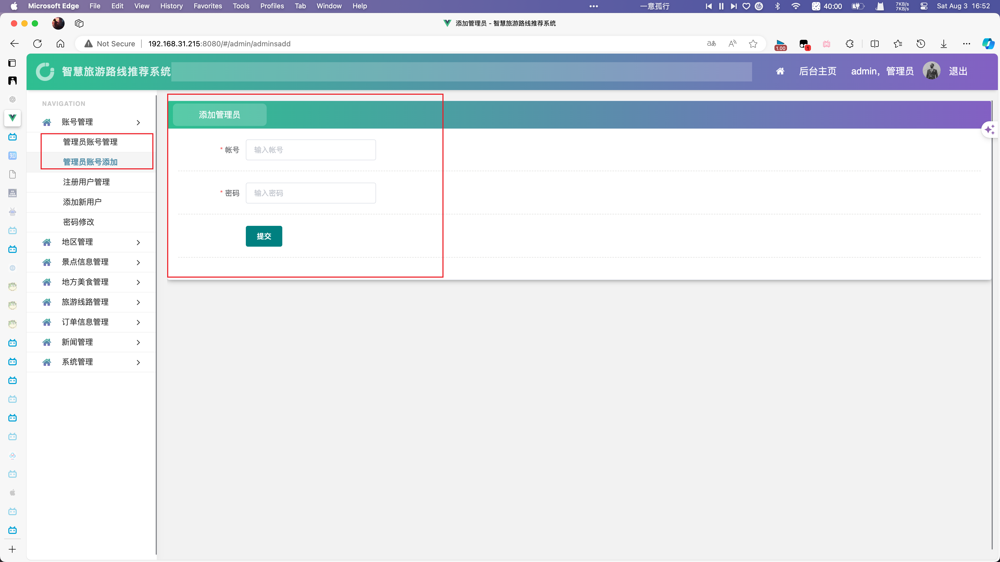

##### 11.2.2 用户管理
在用户管理部分，管理员可以对普通用户的账号进行增删查改以及修改密码的操作。这个功能确保用户信息的准确和安全。


##### 11.2.3 地区管理
由于海外旅游和本地旅游现在成为一大热点，因此在系统中增加了境外、境内、本地三个地区。在地区管理部分实现了地区信息的增删查改。


##### 11.2.4 景点管理
管理员可以在景点管理部分对景点信息进行增删查改，包括编辑景点描述和详情信息。这部分功能确保旅游景点信息的准确和更新。


##### 11.2.5 地方美食管理
地方美食管理模块分为四个部分，分别是美食分类添加查询与地方美食添加查询。管理员可以增加美食编号、名称、附近景点分类、人均价格、美食简介等信息。


通过点击信息按钮，管理员可以查看美食的详情界面，并且可以打印美食信息的详情页。


##### 11.2.6 旅游线路管理
在旅游管理模块中设置了旅游线路的添加与查询功能。管理员可以添加旅游编号、线路名称、图片、出发地、途径地、终点、价格、浏览量等信息。


通过点击信息按钮，管理员能看到每一个路线的详情，甚至可以打印出来。


##### 11.2.7 订单信息管理
订单预订信息的管理模块允许管理员查看每个用户的预订信息，确保订单处理的准确和及时。


##### 11.2.8 新闻管理
新闻管理模块分为新闻分类的添加与查询以及新闻内容的添加与查询。管理员可以方便地管理旅游相关的新闻信息。


##### 11.2.9 系统管理
系统管理部分实现了友情链接的添加查询、轮播图的添加查询以及留言管理。该功能确保系统内容的丰富性和用户互动的有效性。


#### 11.3 后台系统（普通用户部分）

##### 11.3.1 线路预订管理
普通用户可以在系统中进行旅游线路的预订，方便快捷。


##### 11.3.2 个人中心管理
个人中心的管理包括修改个人资料、修改密码、我的收藏、我的留言等功能，方便用户管理个人信息和互动。


### 十二·测试
系统测试包括单元测试、集成测试和系统测试，目的是在软件投入运行前尽可能多地发现错误，确保软件质量。

___具体测试包含在[项目presentation](#项目presentation)中体现___


## 十三·代码解释
___这里只展示部分代码，剩下部分主要在[项目presentation](#项目presentation)___
### 13.1·地方美食管理（DifangmeishiController） 功能总结

`DifangmeishiController` 是一个 Spring MVC 控制器类，负责管理地方美食相关的操作。以下是该类的主要功能概述：

### 后台功能

1. **列表页 (`/difangmeishi_list`)**
   - 检查用户是否登录，未登录则跳转到登录页面。
   - 从请求参数中获取排序方式和分页信息，构建查询条件并执行查询，返回地方美食列表。

2. **添加页面 (`/difangmeishi_add`)**
   - 初始化数据并返回添加地方美食的页面。

3. **更新页面 (`/difangmeishi_updt`)**
   - 根据ID获取地方美食信息，并返回更新页面。

4. **插入数据 (`/difangmeishiinsert`)**
   - 从请求中获取地方美食信息，创建实体并插入数据库，返回操作结果。
   ```java
   @RequestMapping("/difangmeishiinsert")
   public String insert()
   {
       _var = new LinkedHashMap(); // 重置数据
       String tmp="";
       Difangmeishi post = new Difangmeishi();  // 创建实体类
       // 设置前台提交上来的数据到实体类中
       post.setMeishibianhao(Request.get("meishibianhao"));
       post.setMingcheng(Request.get("mingcheng"));
       post.setFujinjingdian(Request.get("fujinjingdian"));
       post.setFenlei(Request.get("fenlei"));
       post.setTupian(Request.get("tupian"));
       post.setJiage(Request.getDouble("jiage"));
       post.setMeishijianjie(Request.get("meishijianjie"));
       post.setAddtime(Info.getDateStr());

       service.insert(post); // 插入数据
       int charuid = post.getId().intValue();

       if(isAjax()){
           return jsonResult(post);
       }
       return showSuccess("保存成功", Request.get("referer").equals("") ? request.getHeader("referer") : Request.get("referer"));
   }
   ```

5. **更新数据 (`/difangmeishiupdate`)**
   - 从请求中获取更新后的地方美食信息，更新数据库中的记录，返回操作结果。

6. **详情页 (`/difangmeishi_detail`)**
   - 根据ID获取地方美食的详细信息，返回详情页面。

7. **删除记录 (`/difangmeishi_delete`)**
   - 根据ID删除指定的地方美食记录，返回操作结果。
    ```java
    @RequestMapping("/difangmeishi_delete")
    public String delete()
    {
        _var = new LinkedHashMap(); // 重置数据
        if(!checkLogin()){
            return showError("尚未登录");
        }
        int id = Request.getInt("id");  // 根据id 删除某行数据
        HashMap map = Query.make("difangmeishi").find(id);

                service.delete(id);// 根据id 删除某行数据
                return showSuccess("删除成功",request.getHeader("referer"));//弹出删除成功，并跳回上一页
    }
    ```

### 前台功能

1. **列表页 (`/difangmeishilist`)**
   - 构建查询条件，获取地方美食列表，返回前台显示。

2. **详情页 (`/difangmeishidetail`)**
   - 根据ID获取地方美食的详细信息，返回前台详情页面。

### 辅助方法

- **getWhere**
  - 从请求中获取筛选条件，构建SQL查询条件。

### 其他功能

- 分页功能：通过获取 `page` 和 `pagesize` 参数实现分页。
- 排序功能：通过获取 `order` 和 `sort` 参数实现排序。
- 数据分配：使用 `assign` 方法将数据分配给前台页面使用。
- 通用数据库访问：使用 `CommDAO` 执行通用的数据库查询。

该控制器类结合了服务层 (`DifangmeishiService`) 和数据访问层 (`DifangmeishiMapper`)，实现了地方美食的增删改查及列表展示等功能。

### 13.2·旅游线路管理（LvyouxianluController）功能总结

`LvyouxianluController` 是一个 Spring MVC 控制器类，负责管理旅游线路相关的操作。以下是该类的主要功能概述：

### 后台功能

1. **列表页 (`/lvyouxianlu_list`)**
   - 检查用户是否登录，未登录则跳转到登录页面。
   - 从请求参数中获取排序方式和分页信息，构建查询条件并执行查询，返回旅游线路列表。
   ```java
    public class LvyouxianluController extends BaseController
    {
        @Autowired
        private LvyouxianluMapper dao;
        @Autowired
        private LvyouxianluService service;

        /**
        *  后台列表页
        *
        */
        @RequestMapping("/lvyouxianlu_list")
        public String list()
        {

            // 检测是否有登录，没登录则跳转到登录页面
            if(!checkLogin()){
                return showError("尚未登录" , "./login.do");
            }

            String order = Request.get("order" , "id"); // 获取前台提交的URL参数 order  如果没有则设置为id
            String sort  = Request.get("sort" , "desc"); // 获取前台提交的URL参数 sort  如果没有则设置为desc
            int    pagesize = Request.getInt("pagesize" , 12); // 获取前台一页多少行数据
            Example example = new Example(Lvyouxianlu.class); //  创建一个扩展搜索类
            Example.Criteria criteria = example.createCriteria();          // 创建一个扩展搜索条件类
            String where = " 1=1 ";   // 创建初始条件为：1=1
            where += getWhere();      // 从方法中获取url 上的参数，并写成 sql条件语句
            criteria.andCondition(where);   // 将条件写进上面的扩展条件类中
            if(sort.equals("desc")){        // 判断前台提交的sort 参数是否等于  desc倒序  是则使用倒序，否则使用正序
                example.orderBy(order).desc();  // 把sql 语句设置成倒序
            }else{
                example.orderBy(order).asc();   // 把 sql 设置成正序
            }
            int page = request.getParameter("page") == null ? 1 : Integer.valueOf(request.getParameter("page"));  // 获取前台提交的URL参数 page  如果没有则设置为1
            page = Math.max(1 , page);  // 取两个数的最大值，防止page 小于1
            List<Lvyouxianlu> list = service.selectPageExample(example , page , pagesize);   // 获取当前页的行数


            
            // 将列表写给界面使用
            assign("totalCount" , request.getAttribute("totalCount"));
            assign("list" , list);
            assign("orderby" , order);  // 把当前排序结果写进前台
            assign("sort" , sort);      // 把当前排序结果写进前台
            return json();   // 将数据写给前端
        }
    ```

2. **添加页面 (`/lvyouxianlu_add`)**
   - 初始化数据并返回添加旅游线路的页面。

3. **更新页面 (`/lvyouxianlu_updt`)**
   - 根据ID获取旅游线路信息，并返回更新页面。

4. **插入数据 (`/lvyouxianluinsert`)**
   - 从请求中获取旅游线路信息，创建实体并插入数据库，返回操作结果。

5. **更新数据 (`/lvyouxianluupdate`)**
   - 从请求中获取更新后的旅游线路信息，更新数据库中的记录，返回操作结果。

6. **详情页 (`/lvyouxianlu_detail`)**
   - 根据ID获取旅游线路的详细信息，返回详情页面。

7. **删除记录 (`/lvyouxianlu_delete`)**
   - 根据ID删除指定的旅游线路记录，返回操作结果。

### 前台功能

1. **列表页 (`/lvyouxianlulist`)**
   - 构建查询条件，获取旅游线路列表，返回前台显示。

2. **详情页 (`/lvyouxianludetail`)**
   - 根据ID获取旅游线路的详细信息，增加浏览量，返回前台详情页面。

### 辅助方法

- **getWhere**
  - 从请求中获取筛选条件，构建SQL查询条件。
  ```java
      public String getWhere()
    {
        _var = new LinkedHashMap(); // 重置数据
        String where = " ";
        // 以下也是一样的操作，判断是否符合条件，符合则写入sql 语句
            if(!Request.get("xianlubianhao").equals("")) {
            where += " AND xianlubianhao LIKE '%"+Request.get("xianlubianhao")+"%' ";
        }
                if(!Request.get("xianlumingcheng").equals("")) {
            where += " AND xianlumingcheng LIKE '%"+Request.get("xianlumingcheng")+"%' ";
        }
                if(!Request.get("chufadi").equals("")) {
            where += " AND chufadi LIKE '%"+Request.get("chufadi")+"%' ";
        }
                if(!Request.get("tujingdi").equals("")) {
            where += " AND tujingdi LIKE '%"+Request.get("tujingdi")+"%' ";
        }
                if(!Request.get("zhongdian").equals("")) {
            where += " AND zhongdian LIKE '%"+Request.get("zhongdian")+"%' ";
        }
            return where;
    }
    ```

### 其他功能

- 分页功能：通过获取 `page` 和 `pagesize` 参数实现分页。
- 排序功能：通过获取 `order` 和 `sort` 参数实现排序。
- 数据分配：使用 `assign` 方法将数据分配给前台页面使用。
- 通用数据库访问：使用 `CommDAO` 执行通用的数据库查询。

该控制器类结合了服务层 (`LvyouxianluService`) 和数据访问层 (`LvyouxianluMapper`)，实现了旅游线路的增删改查及列表展示等功能。


## 十四·项目结构
```plaintext
.
├── LICENSE
├── README.md
├── bysj-client1
│   ├── babel.config.js
│   ├── package-lock.json
│   ├── package.json
│   ├── public
│   │   ├── favicon.ico
│   │   ├── index.html
│   │   └── static
│   ├── src
│   │   ├── App.vue
│   │   ├── api.js
│   │   ├── assets
│   │   ├── components
│   │   ├── config.js
│   │   ├── main.js
│   │   ├── router
│   │   ├── setting.js
│   │   ├── store
│   │   ├── styles.scss
│   │   ├── utils
│   │   └── views
│   ├── test
│   │   ├── README.md
│   │   ├── index.html
│   │   ├── jsconfig.json
│   │   ├── package-lock.json
│   │   ├── package.json
│   │   ├── public
│   │   ├── src
│   │   └── vite.config.js
│   ├── test.iml
│   ├── vue.config.js
│   └── webpack.config.js
├── bysj-server
│   ├── HELP.md
│   ├── WEB-INF
│   │   └── web.xml
│   ├── bysj-server.iml
│   ├── database
│   │   └── spbootvue07987lyxxtjxtsjysx.sql
│   ├── mvnw
│   ├── mvnw.cmd
│   ├── out
│   │   └── artifacts
│   ├── package-lock.json
│   ├── pom.xml
│   ├── src
│   │   └── main
│   ├── target
│   │   ├── BOOT-INF
│   │   ├── classes
│   │   ├── generated-sources
│   │   ├── maven-archiver
│   │   ├── maven-status
│   │   ├── travel-0.0.1-SNAPSHOT.jar
│   │   └── travel-0.0.1-SNAPSHOT.jar.original
│   └── 数据库表结构.doc
├── project-structure.txt
└── 数据库文件
    └── spbootvue07987.sql

983 directories, 35 files
```


## 参考文献

[1] Coutinho, T. (蒂亚哥). 酒店管理信息系统建设研究[D]. 天津大学, 2021. DOI:10.27356/d.cnki.gtjdu.2021.003245.

[2] 贺菁. 基于Java的旅游信息管理系统的设计与实现[D]. 吉林大学, 2017.

[3] 景昕蒂. 基于Google Maps的大连市旅游信息系统的设计与开发[D]. 辽宁师范大学, 2011. DOI:10.7666/d.y1890737.

[4] 朱炳贵. 旅游地理信息系统的研究[J]. 国土资源遥感, 2002, 3.