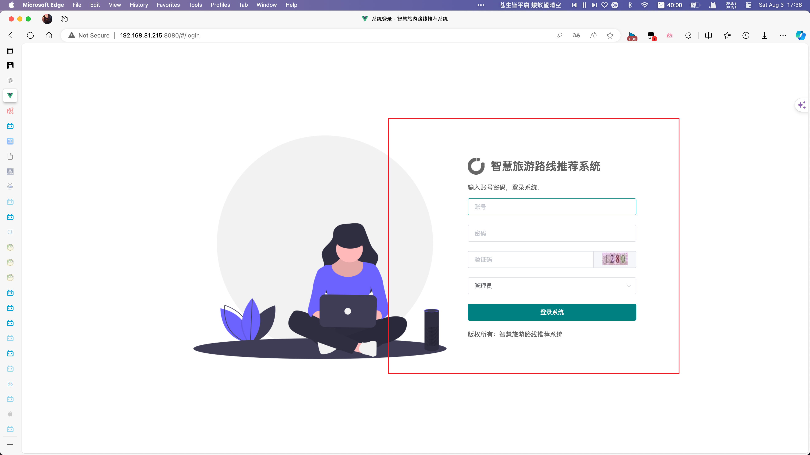

# java-travel-information-system
一个低级程序猿的sql作业罢了


# 基于 Java 的旅游信息管理系统的设计与实现

## 目录
1. [实验目的](#一实验目的)
2. [实验内容和要求](#二实验内容和要求)
3. [实验重点和难点](#三实验重点和难点)
4. [项目概述](#四项目概述)
5. [课题背景](#五课题背景)
6. [国内外研究现状](#六国内外研究现状)
7. [本文主要内容](#七本文主要内容)
8. [论文组织结构](#八论文组织结构)
9. [相关技术简介](#九相关技术简介)
    - [JAVA WEB 开发技术](#91-java-web-开发技术)
    - [软件体系结构](#92-软件体系结构)
    - [SQL SERVER 数据库](#93-sql-server-数据库)
10. [需求分析](#十需求分析)
    - [系统可行性研究](#101-系统可行性研究)
    - [系统需求分析](#102-系统需求分析)
    - [系统开发环境](#103-系统开发环境)
11. [系统实现](#十一系统实现)
12. [测试](#十二测试)
13. [总结](#十三总结)
14. [致谢](#十四致谢)
15. [项目结构](#十五项目结构)
16. [参考文献](#十六参考文献)

## 一·实验目的
综合训练学生运用数据库原理、方法和技术进行数据库应用系统分析、设计和开发的能力。

## 二·实验内容和要求
为某个部门或单位开发一个数据库应用系统，具体内容包括：对某个部门或单位业务和数据进行调查，系统分析，系统设计，数据库设计，数据库创建和数据加载，数据库应用软件开发，系统测试，系统分析设计和开发文档撰写，软件、文档和数据库提交，数据库应用系统运行演示和大作业汇报。能够针对某个部门或单位的应用需求，通过系统分析，从数据库数据和应用系统功能两方面进行综合设计，实现一个完整的数据库应用系统。撰写系统设计和开发文档；提交系统文档、数据库应用软件和数据库。

## 三·实验重点和难点
实验重点：数据库设计，数据库应用软件开发。
实验难点：综合运用系统分析与设计方法，从数据和功能两方面协调设计一个完整的数据库应用系统。熟练掌握和运用一个主流数据库应用开发工具进行数据库应用软件开发。

## 四·项目概述
旅游信息管理系统是一个用于管理旅游信息资源的平台。随着旅游信息种类和数量的增加，传统的人力管理方式逐渐无法满足需求，因此开发了这个系统。系统提供了分类管理信息的功能，并以旅游信息的具体方面作为模块划分依据，旨在提高信息管理效率，节省人力物力资源。

## 五·课题背景
随着我国人们生活水平的不断提高，旅游逐渐成为人们工作之余放松压力、调节情绪的首要选择。近年来，我国旅游游客规模不断扩大，旅游业得到快速发展，但也带来了更激烈的竞争。面对更复杂的旅游业务需求，现在旅游业必须加大对当地旅游资源的宣传力度，采用更先进的技术来完成日常管理，为游客提供优质服务，帮助他们在出行时快捷、方便地查询旅游目的地的景点、酒店、交通情况。这将有助于提高城市的旅游形象和旅游服务水平。

## 六·国内外研究现状
随着计算机和网络技术的快速发展，其在社会各行各业的应用逐渐普及，越来越多的行业采用先进的计算机网络技术来管理行业信息。目前，世界范围内已有多个国家和地区成功实施了旅游信息管理系统。然而，国内旅游业的信息化进程相对缓慢，大多数城市的旅游宣传和管理方式仍以人工为主，这不仅浪费了人力和物力资源，也限制了旅游业的发展。国际上，一些发达国家已广泛使用信息管理系统来管理旅游信息，提供高度自动化和用户友好的服务平台。

## 七·本文主要内容
本文主要介绍基于 Java 技术的旅游信息管理系统的设计与实现过程。系统旨在通过现代信息技术整合和管理旅游信息资源，提高信息管理的效率，为游客提供快捷、方便的查询服务。

## 九·相关技术简介

### 9.1 JAVA WEB 开发技术

#### 9.1.1 MVC 模式
MVC（Model-View-Controller）模式是一种软件设计模式，常用于创建 Web 应用。它将应用程序分为三个部分：模型（Model）、视图（View）和控制器（Controller），从而实现数据与用户界面的分离。

#### 9.1.2 Vue 3 框架
Vue 3 是一个用于构建用户界面的渐进式 JavaScript 框架。它采用基于组件的开发模式，提供了响应式的数据绑定和强大的工具链，适用于构建复杂的单页应用程序。

#### 9.1.3 Java Web 开发
Java Web 开发是指使用 Java 技术进行 Web 应用程序的开发。常用的技术栈包括 Servlet、JSP、Spring MVC 等，适用于构建高性能、可扩展的企业级 Web 应用。

#### 9.1.4 HTML 语言
HTML（HyperText Markup Language）是一种用于创建网页的标准标记语言。它通过标记文本来定义页面的结构，使得页面可以在 Web 浏览器中显示。

### 9.2 软件体系结构

#### 9.2.1 B/S 结构
B/S（Browser/Server，浏览器/服务器）结构是网络应用中一种常见的架构模式。客户端通过浏览器访问服务器，服务器处理请求并返回数据。该结构便于维护和更新应用程序，且不需要安装客户端软件。

#### 9.2.2 C/S 结构
C/S（Client/Server，客户端/服务器）结构是另一种常见的架构模式，客户端软件需要安装在用户的本地计算机上，通过网络与服务器通信。该结构多用于桌面应用和需要较高交互性的应用。

### 9.3 MySQL 数据库
MySQL 是一个开源的关系数据库管理系统，它支持多用户环境下的数据库应用。MySQL 提供了存储、查询、更新数据的功能，并能与多种编程语言和平台紧密集成，为企业级应用提供强大的数据支持。

## 十·需求分析

### 10.1 系统可行性研究
在开发旅游信息管理系统之前，必须进行系统可行性研究。研究应包括技术可行性、经济可行性和操作可行性。通过这些研究，能够确定系统是否值得开发，是否符合预期目标，以及是否能够顺利实施。

#### 10.1.1 技术可行性
随着计算机技术、网络技术和数据库技术的快速发展，人们的生活逐渐信息化。旅游信息管理系统可以采用先进的信息化技术来进行数据处理、信息存储和用户界面的开发。基于 B/S（浏览器/服务器）结构，用户可以通过浏览器访问系统，服务器端处理数据请求并返回结果。这种模式便于系统的维护和扩展，提高了系统的稳定性和安全性。

#### 10.1.2 经济可行性
开发和运行旅游信息管理系统需要一定的资金投入，包括硬件和软件的采购、开发团队的薪酬以及系统的维护和更新。虽然初期投入较大，但通过信息化系统的应用，可以显著提高旅游信息管理的效率，减少人力和物力的浪费，从长远来看具有很高的经济效益。

#### 10.1.3 操作可行性
系统的操作应简便易用，使得用户和管理员能够方便地进行各种操作。通过友好的用户界面和清晰的操作指引，系统能够确保用户快速上手并完成所需操作。系统还应具备良好的兼容性和稳定性，保证在不同操作环境下的正常运行。

### 10.2 系统需求分析

#### 10.2.1 系统实现目标
系统的主要目标是为游客提供一个全面、便捷的旅游信息查询平台，帮助他们在计划出行时能快速获取所需信息。同时，系统还需要为旅游管理者提供有效的工具，以便他们能够更好地管理和宣传当地的旅游资源。

#### 10.2.2 系统功能需求
系统需要具备的功能包括用户注册与登录、旅游景点信息的查询、旅游路线规划、酒店预订、交通信息查询、在线留言与反馈等。

#### 10.2.3 系统用例分析
系统用例分析是识别系统各部分行为的重要步骤。通过用例图，可以明确系统中不同用户的交互模式及其需要完成的任务。例如，用户注册与登录、景点信息查询、路线规划、酒店预订等都是系统的重要用例，每个用例都涉及到用户和系统之间的交互过程。

#### 10.2.4 系统性能需求
系统应具备以下性能要求：
1. **响应速度**：系统应具有较高的响应速度，确保用户能够在较短的时间内获取所需信息。
2. **可靠性**：系统应具备较高的可靠性，确保数据的完整性和用户信息的安全。
3. **扩展性**：系统应具备良好的扩展性，以便未来增加新功能或进行系统升级。
4. **安全性**：系统应具备良好的安全性，保护用户数据和系统数据免受未经授权的访问和操作。

### 10.3 系统开发环境
系统的开发环境包括硬件环境和软件环境。

#### 10.3.1 硬件环境
- 服务器：用于部署系统的服务器，需要具备较高的性能和稳定性。
- 客户端设备：用户通过浏览器访问系统，可以使用个人电脑、平板电脑或智能手机等设备。

#### 10.3.2 软件环境
- 操作系统：服务器操作系统可以选择 Linux 或 Windows，客户端操作系统不限。
- 开发工具：使用 Eclipse 或 IntelliJ IDEA 进行系统开发。
- 编程语言：系统开发采用 Java 语言。
- 数据库：使用 MySQL 作为数据库管理系统。

以上内容为旅游信息管理系统的详细需求分析，涵盖了系统可行性研究、系统需求分析及系统开发环境的各个方面。通过这些分析，可以为系统的设计与开发提供明确的指导和参考。


## 十一·系统实现

### 前台系统

#### 用户登录
首先是用户登录部分，用户可以通过用户名和密码登录系统：


#### 区分登录身份
登录区分管理员与普通用户，管理员和普通用户会进入不同的系统界面：


- **管理员登录**：管理员登录会直接进入管理后台，方便进行管理操作。
    

- **普通用户登录**：普通用户登录后会进入个人主页，主页中包含了线路预订与个人中心功能。
    
    

#### 主页功能
普通用户登录后进入个人主页，可以进行线路预订和管理个人信息。主页界面直观友好，方便用户快速找到所需功能。


### 后台系统（管理员部分）

#### 账号管理
管理员在后台可以对系统账号进行管理，实现管理员账户的增删查改。该功能确保系统账号的安全和有效管理。


#### 用户管理
在用户管理部分，管理员可以对普通用户的账号进行增删查改以及修改密码的操作。这个功能确保用户信息的准确和安全。


#### 地区管理
由于海外旅游和本地旅游现在成为一大热点，因此在系统中增加了境外、境内、本地三个地区。在地区管理部分实现了地区信息的增删查改。


#### 景点管理
管理员可以在景点管理部分对景点信息进行增删查改，包括编辑景点描述和详情信息。这部分功能确保旅游景点信息的准确和更新。


#### 地方美食管理
地方美食管理模块分为四个部分，分别是美食分类添加查询与地方美食添加查询。管理员可以增加美食编号、名称、附近景点分类、人均价格、美食简介等信息。


通过点击信息按钮，管理员可以查看美食的详情界面，并且可以打印美食信息的详情页。


#### 旅游线路管理
在旅游管理模块中设置了旅游线路的添加与查询功能。管理员可以添加旅游编号、线路名称、图片、出发地、途径地、终点、价格、浏览量等信息。


通过点击信息按钮，管理员能看到每一个路线的详情，甚至可以打印出来。


#### 订单信息管理
订单预订信息的管理模块允许管理员查看每个用户的预订信息，确保订单处理的准确和及时。


#### 新闻管理
新闻管理模块分为新闻分类的添加与查询以及新闻内容的添加与查询。管理员可以方便地管理旅游相关的新闻信息。


#### 系统管理
系统管理部分实现了友情链接的添加查询、轮播图的添加查询以及留言管理。该功能确保系统内容的丰富性和用户互动的有效性。


### 后台系统（普通用户部分）

#### 线路预订管理
普通用户可以在系统中进行旅游线路的预订，方便快捷。


#### 个人中心管理
个人中心的管理包括修改个人资料、修改密码、我的收藏、我的留言等功能，方便用户管理个人信息和互动。


## 十二·测试
系统测试包括单元测试、集成测试和系统测试，目的是在软件投入运行前尽可能多地发现错误，确保软件质量。
具体测试包含在演示视频中体现

## 十三·总结
通过系统开发，提高了对系统分析、数据流图、数据字典等系统设计工具的认识，积累了宝贵的经验。

## 十四·致谢
感谢学校和指导老师在设计过程中的帮助和建议，使系统开发水平得到了提高。

## 十五·项目结构
```plaintext
.
├── LICENSE
├── README.md
├── bysj-client1
│   ├── babel.config.js
│   ├── package-lock.json
│   ├── package.json
│   ├── public
│   │   ├── favicon.ico
│   │   ├── index.html
│   │   └── static
│   ├── src
│   │   ├── App.vue
│   │   ├── api.js
│   │   ├── assets
│   │   ├── components
│   │   ├── config.js
│   │   ├── main.js
│   │   ├── router
│   │   ├── setting.js
│   │   ├── store
│   │   ├── styles.scss
│   │   ├── utils
│   │   └── views
│   ├── test
│   │   ├── README.md
│   │   ├── index.html
│   │   ├── jsconfig.json
│   │   ├── package-lock.json
│   │   ├── package.json
│   │   ├── public
│   │   ├── src
│   │   └── vite.config.js
│   ├── test.iml
│   ├── vue.config.js
│   └── webpack.config.js
├── bysj-server
│   ├── HELP.md
│   ├── WEB-INF
│   │   └── web.xml
│   ├── bysj-server.iml
│   ├── database
│   │   └── spbootvue07987lyxxtjxtsjysx.sql
│   ├── mvnw
│   ├── mvnw.cmd
│   ├── out
│   │   └── artifacts
│   ├── package-lock.json
│   ├── pom.xml
│   ├── src
│   │   └── main
│   ├── target
│   │   ├── BOOT-INF
│   │   ├── classes
│   │   ├── generated-sources
│   │   ├── maven-archiver
│   │   ├── maven-status
│   │   ├── travel-0.0.1-SNAPSHOT.jar
│   │   └── travel-0.0.1-SNAPSHOT.jar.original
│   └── 数据库表结构.doc
├── project-structure.txt
└── 数据库文件
    └── spbootvue07987.sql

983 directories, 35 files
```


## 参考文献
1. Todd Cook. JSP从入门到精通[M]. 北京：电子工业出版社，2003.
2. Soren Lauesen. Software Requirements Styles and Techniques[M]. 北京：电子工业出版社，2002.
3. Roger S. Pressman. Software Engineering A Practitioner’s Approach 5th ed[M]. 北京：清华大学出版社，2001.
4. Hans Bergsten. JavaServer Pages_2nd Edition[M]. O'Reilly, 2002.
5. Kevin Duffey, Vikram Goyal. Professional JSP Site Design[M]. 北京：电子工业出版社，2002.
6. Paul C. Jorgensen. Software Testing A Craftsman’s Approach (second Edition)[M]. China Machine Press, 2003.
