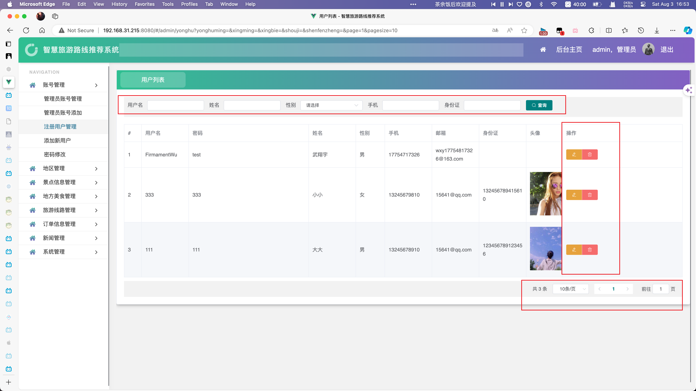
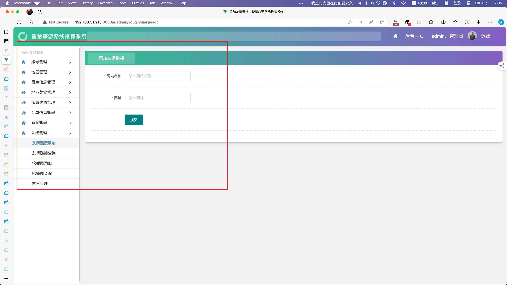

# java-travel-information-system
一个低级程序猿的sql作业罢了


# 基于 Java 的旅游信息管理系统的设计与实现

## 目录
1. [实验目的](#一实验目的)
2. [实验内容和要求](#二实验内容和要求)
3. [实验重点和难点](#三实验重点和难点)
4. [项目概述](#四项目概述)
5. [课题背景](#五课题背景)
6. [国内外研究现状](#六国内外研究现状)
7. [本文主要内容](#七本文主要内容)
8. [论文组织结构](#八论文组织结构)
9. [相关技术简介](#九相关技术简介)
    - [JAVA WEB 开发技术](#91-java-web-开发技术)
    - [软件体系结构](#92-软件体系结构)
    - [SQL SERVER 数据库](#93-sql-server-数据库)
10. [需求分析](#十需求分析)
    - [系统可行性研究](#101-系统可行性研究)
    - [系统需求分析](#102-系统需求分析)
    - [系统开发环境](#103-系统开发环境)
11. [系统实现](#十一系统实现)
12. [测试](#十二测试)
13. [总结](#十三总结)
14. [致谢](#十四致谢)
15. [项目结构](#十五项目结构)
16. [参考文献](#十六参考文献)

## 一·实验目的
综合训练学生运用数据库原理、方法和技术进行数据库应用系统分析、设计和开发的能力。

## 二·实验内容和要求
为某个部门或单位开发一个数据库应用系统，具体内容包括：对某个部门或单位业务和数据进行调查，系统分析，系统设计，数据库设计，数据库创建和数据加载，数据库应用软件开发，系统测试，系统分析设计和开发文档撰写，软件、文档和数据库提交，数据库应用系统运行演示和大作业汇报。能够针对某个部门或单位的应用需求，通过系统分析，从数据库数据和应用系统功能两方面进行综合设计，实现一个完整的数据库应用系统。撰写系统设计和开发文档；提交系统文档、数据库应用软件和数据库。

## 三·实验重点和难点
实验重点：数据库设计，数据库应用软件开发。
实验难点：综合运用系统分析与设计方法，从数据和功能两方面协调设计一个完整的数据库应用系统。熟练掌握和运用一个主流数据库应用开发工具进行数据库应用软件开发。

## 四·项目概述
旅游信息管理系统是一个用于管理旅游信息资源的平台。随着旅游信息种类和数量的增加，传统的人力管理方式逐渐无法满足需求，因此开发了这个系统。系统提供了分类管理信息的功能，并以旅游信息的具体方面作为模块划分依据，旨在提高信息管理效率，节省人力物力资源。

## 五·课题背景
随着我国人们生活水平的不断提高，旅游逐渐成为人们工作之余放松压力、调节情绪的首要选择。近年来，我国旅游游客规模不断扩大，旅游业得到快速发展，但也带来了更激烈的竞争。面对更复杂的旅游业务需求，现在旅游业必须加大对当地旅游资源的宣传力度，采用更先进的技术来完成日常管理，为游客提供优质服务，帮助他们在出行时快捷、方便地查询旅游目的地的景点、美食、交通情况。这将有助于提高城市的旅游形象和旅游服务水平。

## 六·国内外研究现状
随着计算机和网络技术的快速发展，其在社会各行各业的应用逐渐普及，越来越多的行业采用先进的计算机网络技术来管理行业信息。目前，世界范围内已有多个国家和地区成功实施了旅游信息管理系统。然而，国内旅游业的信息化进程相对缓慢，大多数城市的旅游宣传和管理方式仍以人工为主，这不仅浪费了人力和物力资源，也限制了旅游业的发展。国际上，一些发达国家已广泛使用信息管理系统来管理旅游信息，提供高度自动化和用户友好的服务平台。

## 七·本文主要内容
本文主要介绍基于 Java 技术的旅游信息管理系统的设计与实现过程。系统旨在通过现代信息技术整合和管理旅游信息资源，提高信息管理的效率，为游客提供快捷、方便的查询服务。

## 八·相关技术简介

### 8.1 JAVA WEB 开发技术

#### 8.1.1 MVC 模式
MVC（Model-View-Controller）模式是一种软件设计模式，常用于创建 Web 应用。它将应用程序分为三个部分：模型（Model）、视图（View）和控制器（Controller），从而实现数据与用户界面的分离。

#### 8.1.2 Vue 2 框架
Vue 2 是一个用于构建用户界面的渐进式 JavaScript 框架。它采用基于组件的开发模式，提供了响应式的数据绑定和强大的工具链，适用于构建复杂的单页应用程序。Vue 2 具有轻量级、高性能和易于集成的特点，广泛应用于各种 Web 项目中。

#### 8.1.3 Java Web 开发
Java Web 开发是指使用 Java 技术进行 Web 应用程序的开发。常用的技术栈包括 Mybatis、VUE、Spring MVC 等，适用于构建高性能、可扩展的企业级 Web 应用。

#### 8.1.4 MyBatis 框架
MyBatis 是一个优秀的持久层框架，它支持自定义 SQL、存储过程以及高级映射。MyBatis 避免了几乎所有的 JDBC 代码和手动设置参数以及获取结果集。MyBatis 可以与各种数据库和编程语言集成，适用于构建复杂的企业级应用程序。

### 8.2 软件体系结构

#### 8.2.1 B/S 结构
B/S（Browser/Server，浏览器/服务器）结构是网络应用中一种常见的架构模式。客户端通过浏览器访问服务器，服务器处理请求并返回数据。该结构便于维护和更新应用程序，且不需要安装客户端软件。

#### 8.2.2 C/S 结构
C/S（Client/Server，客户端/服务器）结构是另一种常见的架构模式，客户端软件需要安装在用户的本地计算机上，通过网络与服务器通信。该结构多用于桌面应用和需要较高交互性的应用。

### 8.3 MySQL 数据库
MySQL 是一个开源的关系数据库管理系统，它支持多用户环境下的数据库应用。MySQL 提供了存储、查询、更新数据的功能，并能与多种编程语言和平台紧密集成，为企业级应用提供强大的数据支持。

## 九·需求分析

### 9.1 系统可行性研究
在开发旅游信息管理系统之前，必须进行系统可行性研究。研究应包括技术可行性、经济可行性和操作可行性。通过这些研究，能够确定系统是否值得开发，是否符合预期目标，以及是否能够顺利实施。

#### 9.1.1 技术可行性
随着计算机技术、网络技术和数据库技术的快速发展，人们的生活逐渐信息化。旅游信息管理系统可以采用先进的信息化技术来进行数据处理、信息存储和用户界面的开发。基于 B/S（浏览器/服务器）结构，用户可以通过浏览器访问系统，服务器端处理数据请求并返回结果。这种模式便于系统的维护和扩展，提高了系统的稳定性和安全性。

#### 9.1.2 经济可行性
开发和运行旅游信息管理系统需要一定的资金投入，包括硬件和软件的采购、开发团队的薪酬以及系统的维护和更新。虽然初期投入较大，但通过信息化系统的应用，可以显著提高旅游信息管理的效率，减少人力和物力的浪费，从长远来看具有很高的经济效益。

#### 9.1.3 操作可行性
系统的操作应简便易用，使得用户和管理员能够方便地进行各种操作。通过友好的用户界面和清晰的操作指引，系统能够确保用户快速上手并完成所需操作。系统还应具备良好的兼容性和稳定性，保证在不同操作环境下的正常运行。

### 9.2 系统需求分析

#### 9.2.1 系统实现目标
系统的主要目标是为游客提供一个全面、便捷的旅游信息查询平台，帮助他们在计划出行时能快速获取所需信息。同时，系统还需要为旅游管理者提供有效的工具，以便他们能够更好地管理和宣传当地的旅游资源。

#### 9.2.2 系统功能需求
系统需要具备的功能包括用户注册与登录、旅游景点信息的查询、旅游路线规划、美食查询、旅游线路查询、在线留言与反馈等。

#### 9.2.3 系统用例分析
系统用例分析是识别系统各部分行为的重要步骤。通过用例图，可以明确系统中不同用户的交互模式及其需要完成的任务。例如，用户注册与登录、景点信息查询、路线规划、等都是系统的重要用例，每个用例都涉及到用户和系统之间的交互过程。

#### 9.2.4 系统性能需求
系统应具备以下性能要求：
1. **响应速度**：系统应具有较高的响应速度，确保用户能够在较短的时间内获取所需信息。
2. **可靠性**：系统应具备较高的可靠性，确保数据的完整性和用户信息的安全。
3. **扩展性**：系统应具备良好的扩展性，以便未来增加新功能或进行系统升级。
4. **安全性**：系统应具备良好的安全性，保护用户数据和系统数据免受未经授权的访问和操作。

### 9.3 系统开发环境
系统的开发环境包括硬件环境和软件环境。

#### 9.3.1 硬件环境
- 服务器：用于部署系统的服务器，需要具备较高的性能和稳定性。
- 客户端设备：用户通过浏览器访问系统，可以使用个人电脑、平板电脑或智能手机等设备。

#### 9.3.2 软件环境
- 操作系统：服务器操作系统可以选择 Linux 或 Windows，客户端操作系统不限。
- 开发工具：使用 Eclipse 或 IntelliJ IDEA 进行系统开发。
- 编程语言：系统开发采用 Java 语言。
- 数据库：使用 MySQL 作为数据库管理系统。

以上内容为旅游信息管理系统的详细需求分析，涵盖了系统可行性研究、系统需求分析及系统开发环境的各个方面。通过这些分析，可以为系统的设计与开发提供明确的指导和参考。


## 十·系统设计

### 10.1 系统架构

#### 10.1.1 软件架构

本文的旅游信息管理系统采用当前 Web 应用流行的 B/S 架构，采用 Java 技术开发，系统设计具有一定的灵活性，在系统开发时也具有较高的效率。在系统层，系统用户能够采用各类浏览器实现对旅游信息管理系统前台和后台界面的访问，实现具体的数据交互功能和业务处理功能。在用层，使用 Java 技术和 VUE平台能够实现旅游信息管理系统前后台功能的开发。在数据层，应用 MySQL 对系统的业务和处理数据进行存储、管理和维护，并对旅游信息管理系统中的功能需求进行支持。


#### 10.1.2 网络架构

因为本文的旅游信息管理系统是 B/S 结构，所以在网络架构设计时采用四层和两层的网络结构。系统用户和系统管理员可以使用任何具备 Internet 浏览功能的浏览器，通过 Http 协议访问实现对系统的访问，不需要在客户机上安装任何客户端程序。


### 10.2 系统的概要设计

#### 10.2.1 系统的总体功能结构

在概要设计中，要根据前面所完成的系统需求分析和文档信息，定义系统的主要功能及相应结构。功能分为前台展示和后台维护两个部分，其中前台展示主要包括旅游景点、酒店、交通等信息的展示及查询，后台维护包括管理员对这些信息的增删改查操作。系统的总体功能结构如图 4.3 所示。


### 10.3 各功能模块的结构

本节对系统部分功能模块的结构再进一步细化。

#### 10.3.1 用户信息管理模块

用户信息管理模块分为后台管理员信息的维护模块和前台注册用户的维护模块，并提供对各类用户的权限分配功能。


#### 10.3.2 旅游景点信息维护模块

系统中的旅游景点信息维护可以对本地景点信息进行维护，可在前台实现景点信息的检索和浏览。在后台具有景点信息查询、景点信息添加、景点信息修改和删除功能，具体功能结构如图 4.5 所示。


#### 10.3.3 酒店信息维护模块

本模块中实现本地主要酒店的信息维护功能。具体来说，包括对酒店信息的查询模块、酒店信息添加模块、酒店信息修改模块和酒店信息删除模块。其结构如图 4.6 所示。


#### 10.3.4 交通信息维护模块

系统中的交通信息维护模块包括两个方向，一方面是为游客提供到达目的地的飞机、火车、客车信息，另一方面维护到当地主要景点的公交车信息。


#### 10.3.5 论坛维护模块

论坛维护模块在后台包括对论坛交流区信息维护、版块信息维护、用户论坛权限维护等功能，而在前台系统中，用户可实现主题查询、发帖和回复的功能，对于系统管理员还可以将某个帖子置顶或加精等功能。论坛维护模块的结构如图 4.8 所示。


#### 10.3.6 预订服务模块

系统的预订服务模块，在前台系统中，注册用户可以实现对景区门票、酒店、航班、火车、客车、租车等的预订，而在后台系统中，系统管理员能够对注册用户的预订信息进行处理，并将处理结果反馈给注册用户。图 4.9 所示。


### 10.4 系统的详细设计

概要设计根据系统用户的需求，划分系统中的功能模块，而系统的详细设计是对概要设计划分出来的功能在实现上进行细化，确定各功能模块的实现流程或处理过程。在本节中，选择三个有代表性的系统的功能模块，以其为例，描述这三个功能模块的流程，并以流程图表示。

#### 10.4.1 用户注册功能

用户注册功能是前台系统中的功能。未注册的用户只能有浏览的功能，也就是说只能查看系统后台维护的旅游信息。用户只有在进行注册，成为注册用户后，才可进行预订服务、论坛发帖和回复服务等。图 4.10 描述了用户注册的流程图。


#### 10.4.2 景点信息添加功能

同样，景点信息的添加功能也是后台系统中的功能，由具有管理员权限的旅游从业人员操作，其操作流程如图 4.10 所示。


### 10.5 实体属性图及 E-R 图

#### 10.5.1 实体属性图

系统设计中，每个实体的属性关系都需要明确。以下是系统中的一些主要实体及其属性图：


*图4.1 admins 实体属性图*


*图4.2 difangmeishi 实体属性图*


*图4.3 diqu 实体属性图*


*图4.4 jingdianxinxi 实体属性图*


*图4.5 liuyanban 实体属性图*


*图4.6 lunbotu 实体属性图*


*图4.7 lvyouxianlu 实体属性图*


*图4.8 meishifenlei 实体属性图*


*图4.9 shoucangjilu 实体属性图*


*图4.10 token 实体属性图*


*图4.11 xinwenfenlei 实体属性图*


*图4.12 xinwenxinxi 实体属性图*


*图4.13 yonghu 实体属性图*


*图4.14 youqinglianjie 实体属性图*


*图4.15 yuding 实体属性图*
#### 10.5.2 系统部分 E-R 图

系统部分 E-R 图描述了系统中实体及其关系。该 E-R 图包括用户、管理员、景点、酒店、线路、航班、火车、客车、公交、论坛贴子等实体。


### 10.6 表结构设计

在进行数据库逻辑模型设计后，需要根据所使用的数据库管理系统，设计实际存放数据的数据表结构的物理模型。在本节中，以部分数据表的定义为例，说明对数据库物理结构设计的结果。

#### 10.6.1 admins 表

admins 表用来存储管理员的相关信息。

| 字段名称  | 类型      | 长度 | 是否为空 | 是否为主键 | 说明     |
|-----------|-----------|------|----------|------------|----------|
| id        | int       | 10   | 否       | 是         | 管理员编号 |
| username  | varchar   | 50   | 否       | 否         | 帐号     |
| pwd       | varchar   | 50   | 否       | 否         | 密码     |
| addtime   | timestamp | -    | 否       | 否         | 添加时间 |

#### 10.6.2 difangmeishi 表

difangmeishi 表用来存储地方美食的相关信息。

| 字段名称      | 类型      | 长度 | 是否为空 | 是否为主键 | 说明         |
|---------------|-----------|------|----------|------------|--------------|
| id            | int       | 10   | 否       | 是         | 美食编号     |
| meishibianhao | varchar   | 50   | 否       | 否         | 美食编号     |
| mingcheng     | varchar   | 255  | 否       | 否         | 名称         |
| fujinjingdian | varchar   | 255  | 否       | 否         | 附近景点     |
| fenlei        | int       | 10   | 否       | 否         | 分类         |
| tupian        | text      | -    | 否       | 否         | 图片         |
| jiage         | decimal   | 18,2 | 否       | 否         | 价格         |
| meishijianjie | text      | -    | 否       | 否         | 美食简介     |
| addtime       | timestamp | -    | 否       | 否         | 添加时间     |

#### 10.6.3 diqu 表

diqu 表用来存储地区的相关信息。

| 字段名称      | 类型      | 长度 | 是否为空 | 是否为主键 | 说明         |
|---------------|-----------|------|----------|------------|--------------|
| id            | int       | 10   | 否       | 是         | 地区编号     |
| diqumingcheng | varchar   | 255  | 否       | 否         | 地区名称     |
| addtime       | timestamp | -    | 否       | 否         | 添加时间     |

#### 10.6.4 jingdianxinxi 表

jingdianxinxi 表用来存储景点的信息。

| 字段名称       | 类型       | 长度 | 是否为空 | 是否为主键 | 说明         |
|----------------|------------|------|----------|------------|--------------|
| id             | int        | 10   | 否       | 是         | 景点编号     |
| jingdianbianhao| varchar    | 50   | 否       | 否         | 景点编号     |
| jingdianmingcheng | varchar| 255  | 否       | 否         | 景点名称     |
| suoshudiqu     | int        | 10   | 否       | 否         | 所属地区     |
| tupian         | text       | -    | 否       | 否         | 图片         |
| kaifangshijian | varchar    | 255  | 否       | 否         | 开放时间     |
| fujinmeishi    | text       | -    | 否       | 否         | 附近美食     |
| dizhi          | varchar    | 255  | 否       | 否         | 地址         |
| piaojia        | decimal    | 18,2 | 否       | 否         | 票价         |
| liulanliang    | int        | 11   | 否       | 否         | 浏览量       |
| miaoshu        | longtext   | -    | 否       | 否         | 描述         |
| addtime        | timestamp  | -    | 否       | 否         | 添加时间     |

#### 10.6.5 liuyanban 表

liuyanban 表用来存储留言板的信息。

| 字段名称       | 类型       | 长度 | 是否为空 | 是否为主键 | 说明         |
|----------------|------------|------|----------|------------|--------------|
| id             | int        | 10   | 否       | 是         | 留言编号     |
| xingming       | varchar    | 50   | 否       | 否         | 姓名         |
| lianxidianhua  | varchar    | 50   | 否       | 否         | 联系电话     |
| liuyanneirong  | text       | -    | 否       | 否         | 留言内容     |
| liuyanren      | varchar    | 50   | 否       | 否         | 留言人       |
| huifuneirong   | text       | -    | 否       | 否         | 回复内容     |
| addtime        | timestamp  | -    | 否       | 否         | 添加时间     |

#### 10.6.6 lunbotu 表

lunbotu 表用来存储轮播图的信息。

| 字段名称       | 类型       | 长度 | 是否为空 | 是否为主键 | 说明         |
|----------------|------------|------|----------|------------|--------------|
| id             | int        | 10   | 否       | 是         | 轮播图编号   |
| title          | varchar    | 50   | 否       | 否         | 标题         |
| image          | varchar    | 255  | 否       | 否         | 图片         |
| url            | varchar    | 255  | 否       | 否         | 连接地址     |
| addtime        | timestamp  | -    | 否       | 否         | 添加时间     |

#### 10.6.7 lvyouxianlu 表

lvyouxianlu 表用来存储旅游线路的信息。

| 字段名称       | 类型       | 长度 | 是否为空 | 是否为主键 | 说明         |
|----------------|------------|------|----------|------------|--------------|
| id             | int        | 10   | 否       | 是         | 线路编号     |
| xianlubianhao  | varchar    | 50   | 否       | 否         | 线路编号     |
| xianlumingcheng| varchar    | 255  | 否       | 否         | 线路名称     |
| tupian         | text       | -    | 否       | 否         | 图片         |
| chufadi        | varchar    | 255  | 否       | 否         | 出发地       |
| tujingdi       | varchar    | 255  | 否       | 否         | 途经地       |
| zhongdian      | varchar    | 255  | 否       | 否         | 终点         |
| jiage          | decimal    | 18,2 | 否       | 否         | 价格         |
| liulanliang    | int        | 11   | 否       | 否         | 浏览量       |
| xianlutese     | longtext   | -    | 否       | 否         | 线路特色     |
| xianlujianjie  | longtext   | -    | 否       | 否         | 线路简介     |
| addtime        | timestamp  | -    | 否       | 否         | 添加时间     |

#### 10.6.8 meishifenlei 表

meishifenlei 表用来存储美食分类的信息。

| 字段名称       | 类型       | 长度 | 是否为空 | 是否为主键 | 说明         |
|----------------|------------|------|----------|------------|--------------|
| id             | int        | 10   | 否       | 是         | 分类编号     |
| fenleimingcheng| varchar    | 255  | 否       | 否         | 分类名称     |
| addtime        | timestamp  | -    | 否       | 否         | 添加时间     |

#### 10.6.9 shoucangjilu 表

shoucangjilu 表用来存储收藏记录的信息。

| 字段名称       | 类型       | 长度 | 是否为空 | 是否为主键 | 说明         |
|----------------|------------|------|----------|------------|--------------|
| id             | int        | 10   | 否       | 是         | 记录编号     |
| username       | varchar    | 255  | 否       | 否         | 收藏用户     |
| xwid           | int        | 10   | 否       | 否         | 对应模块id   |
| biao           | varchar    | 255  | 否       | 否         | 收藏的模块   |
| biaoti         | varchar    | 255  | 否       | 否         | 显示的标题   |
| url            | varchar    | 512  | 否       | 否         | 收藏URL      |
| ziduan         | varchar    | 255  | 否       | 否         | 对应模块字段 |
| addtime        | timestamp  | -    | 否       | 否         | 添加时间     |

#### 10.6.10 token 表

token 表用来存储前端登录凭证的信息。

| 字段名称       | 类型       | 长度 | 是否为空 | 是否为主键 | 说明         |
|----------------|------------|------|----------|------------|--------------|
| token          | char       | 32   | 否       | 是         | 唯一值       |
| session        | text       | -    | 否       | 否         | 保存的数据   |
| cx             | varchar    | 50   | 否       | 否         | 登录权限     |
| login          | varchar    | 50   | 否       | 否         | 登录模块     |
| username       | varchar    | 50   | 否       | 否         | 登录用户     |
| valueid        | varchar    | 50   | 否       | 否         | 用户id       |
| token_time     | timestamp  | -    | 否       | 否         | 当前时间     |

#### 10.6.11 xinwenfenlei 表

xinwenfenlei 表用来存储新闻分类的信息。

| 字段名称       | 类型       | 长度 | 是否为空 | 是否为主键 | 说明         |
|----------------|------------|------|----------|------------|--------------|
| id             | int        | 10   | 否       | 是         | 分类编号     |
| fenleimingcheng| varchar    | 50   | 否       | 否         | 分类名称     |
| addtime        | timestamp  | -    | 否       | 否         | 添加时间     |

#### 10.6.12 xinwenxinxi 表

xinwenxinxi 表用来存储新闻信息。

| 字段名称       | 类型       | 长度 | 是否为空 | 是否为主键 | 说明         |
|----------------|------------|------|----------|------------|--------------|
| id             | int        | 10   | 否       | 是         | 新闻编号     |
| biaoti         | varchar    | 255  | 否       | 否         | 标题         |
| fenlei         | int        | 10   | 否       | 否         | 分类         |
| tupian         | varchar    | 255  | 否       | 否         | 图片         |
| tianjiaren     | varchar    | 50   | 否       | 否         | 添加人       |
| dianjilv       | int        | 11   | 否       | 否         | 点击率       |
| neirong        | longtext   | -    | 否       | 否         | 内容         |
| addtime        | timestamp  | -    | 否       | 否         | 添加时间     |

#### 10.6.13 yonghu 表

yonghu 表用来存储用户的信息。

| 字段名称       | 类型       | 长度 | 是否为空 | 是否为主键 | 说明         |
|----------------|------------|------|----------|------------|--------------|
| id             | int        | 10   | 否       | 是         | 用户编号     |
| yonghuming     | varchar    | 50   | 否       | 否         | 用户名       |
| mima           | varchar    | 50   | 否       | 否         | 密码         |
| xingming       | varchar    | 50   | 否       | 否         | 姓名         |
| xingbie        | varchar    | 255  | 否       | 否         | 性别         |
| shouji         | varchar    | 50   | 否       | 否         | 手机         |
| youxiang       | varchar    | 50   | 否       | 否         | 邮箱         |
| shenfenzheng   | varchar    | 50   | 否       | 否         | 身份证       |
| touxiang       | varchar    | 255  | 否       | 否         | 头像         |
| addtime        | timestamp  | -    | 否       | 否         | 添加时间     |

#### 10.6.14 youqinglianjie 表

youqinglianjie 表用来存储友情链接的信息。

| 字段名称       | 类型       | 长度 | 是否为空 | 是否为主键 | 说明         |
|----------------|------------|------|----------|------------|--------------|
| id             | int        | 10   | 否       | 是         | 友情链接编号 |
| wangzhanmingcheng| varchar  | 50   | 否       | 否         | 网站名称     |
| wangzhi        | varchar    | 50   | 否       | 否         | 网址         |
| addtime        | timestamp  | -    | 否       | 否         | 添加时间     |

#### 10.6.15 yuding 表

yuding 表用来存储预定的信息。

| 字段名称       | 类型       | 长度 | 是否为空 | 是否为主键 | 说明         |
|----------------|------------|------|----------|------------|--------------|
| id             | int        | 10   | 否       | 是         | 预定编号     |
| lvyouxianluid  | int        | 10   | 否       | 否         | 旅游线路id   |
| xianlubianhao  | varchar    | 50   | 否       | 否         | 线路编号     |
| xianlumingcheng| varchar    | 255  | 否       | 否         | 线路名称     |
| chufadi        | varchar    | 255  | 否       | 否         | 出发地       |
| tujingdi       | varchar    | 255  | 否       | 否         | 途经地       |
| zhongdian      | varchar    | 255  | 否       | 否         | 终点         |
| jiage          | decimal    | 18,2 | 否       | 否         | 价格         |
| dingdanhao     | varchar    | 50   | 否       | 否         | 订单号       |
| yudingshijian  | varchar    | 25   | 否       | 否         | 预订时间     |
| yudingrenxingming| varchar  | 50   | 否       | 否         | 预订人姓名   |
| lianxifangshi  | varchar    | 50   | 否       | 否         | 联系方式     |
| zhuangtai      | varchar    | 50   | 否       | 否         | 状态         |
| beizhu         | text       | -    | 否       | 否         | 备注         |
| yudingren      | varchar    | 50   | 否       | 否         | 预订人       |
| addtime        | timestamp  | -    | 否       | 否         | 添加时间     |
| iszf           | varchar    | 10   | 否       | 否         | 是否支付     |


## 十一·系统实现

### 前台系统

#### 用户登录
首先是用户登录部分，用户可以通过用户名和密码登录系统：


#### 区分登录身份
登录区分管理员与普通用户，管理员和普通用户会进入不同的系统界面：


- **管理员登录**：管理员登录会直接进入管理后台，方便进行管理操作。
    

- **普通用户登录**：普通用户登录后会进入个人主页，主页中包含了线路预订与个人中心功能。
    
    

#### 主页功能
普通用户登录后进入个人主页，可以进行线路预订和管理个人信息。主页界面直观友好，方便用户快速找到所需功能。


### 后台系统（管理员部分）

#### 账号管理
管理员在后台可以对系统账号进行管理，实现管理员账户的增删查改。该功能确保系统账号的安全和有效管理。


#### 用户管理
在用户管理部分，管理员可以对普通用户的账号进行增删查改以及修改密码的操作。这个功能确保用户信息的准确和安全。



#### 地区管理
由于海外旅游和本地旅游现在成为一大热点，因此在系统中增加了境外、境内、本地三个地区。在地区管理部分实现了地区信息的增删查改。


#### 景点管理
管理员可以在景点管理部分对景点信息进行增删查改，包括编辑景点描述和详情信息。这部分功能确保旅游景点信息的准确和更新。


#### 地方美食管理
地方美食管理模块分为四个部分，分别是美食分类添加查询与地方美食添加查询。管理员可以增加美食编号、名称、附近景点分类、人均价格、美食简介等信息。


通过点击信息按钮，管理员可以查看美食的详情界面，并且可以打印美食信息的详情页。


#### 旅游线路管理
在旅游管理模块中设置了旅游线路的添加与查询功能。管理员可以添加旅游编号、线路名称、图片、出发地、途径地、终点、价格、浏览量等信息。


通过点击信息按钮，管理员能看到每一个路线的详情，甚至可以打印出来。


#### 订单信息管理
订单预订信息的管理模块允许管理员查看每个用户的预订信息，确保订单处理的准确和及时。


#### 新闻管理
新闻管理模块分为新闻分类的添加与查询以及新闻内容的添加与查询。管理员可以方便地管理旅游相关的新闻信息。


#### 系统管理
系统管理部分实现了友情链接的添加查询、轮播图的添加查询以及留言管理。该功能确保系统内容的丰富性和用户互动的有效性。




### 后台系统（普通用户部分）

#### 线路预订管理
普通用户可以在系统中进行旅游线路的预订，方便快捷。


#### 个人中心管理
个人中心的管理包括修改个人资料、修改密码、我的收藏、我的留言等功能，方便用户管理个人信息和互动。


## 十二·测试
系统测试包括单元测试、集成测试和系统测试，目的是在软件投入运行前尽可能多地发现错误，确保软件质量。
具体测试包含在演示视频中体现

## 十三·总结
通过系统开发，提高了对系统分析、数据流图、数据字典等系统设计工具的认识，积累了宝贵的经验。

## 十四·致谢
感谢学校和指导老师在设计过程中的帮助和建议，使系统开发水平得到了提高。

## 十五·项目结构
```plaintext
.
├── LICENSE
├── README.md
├── bysj-client1
│   ├── babel.config.js
│   ├── package-lock.json
│   ├── package.json
│   ├── public
│   │   ├── favicon.ico
│   │   ├── index.html
│   │   └── static
│   ├── src
│   │   ├── App.vue
│   │   ├── api.js
│   │   ├── assets
│   │   ├── components
│   │   ├── config.js
│   │   ├── main.js
│   │   ├── router
│   │   ├── setting.js
│   │   ├── store
│   │   ├── styles.scss
│   │   ├── utils
│   │   └── views
│   ├── test
│   │   ├── README.md
│   │   ├── index.html
│   │   ├── jsconfig.json
│   │   ├── package-lock.json
│   │   ├── package.json
│   │   ├── public
│   │   ├── src
│   │   └── vite.config.js
│   ├── test.iml
│   ├── vue.config.js
│   └── webpack.config.js
├── bysj-server
│   ├── HELP.md
│   ├── WEB-INF
│   │   └── web.xml
│   ├── bysj-server.iml
│   ├── database
│   │   └── spbootvue07987lyxxtjxtsjysx.sql
│   ├── mvnw
│   ├── mvnw.cmd
│   ├── out
│   │   └── artifacts
│   ├── package-lock.json
│   ├── pom.xml
│   ├── src
│   │   └── main
│   ├── target
│   │   ├── BOOT-INF
│   │   ├── classes
│   │   ├── generated-sources
│   │   ├── maven-archiver
│   │   ├── maven-status
│   │   ├── travel-0.0.1-SNAPSHOT.jar
│   │   └── travel-0.0.1-SNAPSHOT.jar.original
│   └── 数据库表结构.doc
├── project-structure.txt
└── 数据库文件
    └── spbootvue07987.sql

983 directories, 35 files
```


## 参考文献

